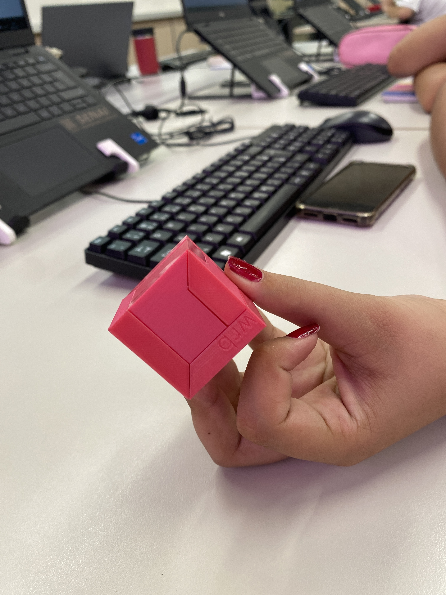

<!DOCTYPE html>
<html lang="pt-br">
<head>
<meta charset="UTF-8">
<title>laura</title>
 
</head>
<body>
<h1 style="color: aqua;">montagem do cubo</h1>

<h5> Turma Dev 1A, grupo da primeira fileira</h2>
 
    

<h4>COMO NOS MONTAMOS O CUBO?</h4>

<h4>Para montar foi preciso paciência e tecnica:</H4>

<h5>NO 03/05 MONTAMOS UM CUBO DE TRÊS PEÇAS.

FOMOS NA MESA DO PROFESSOR E ESCOLHEMOS AS PEÇAS DO NOSSO CUBO , ENTRETANTO COMEÇAMOS A MONTAGEM DO NOSSO CUBO FIZEMOS DE TODA MANEIRA PARA ENCAIXAR ATE ENTÃO DEPOIS DE MUITO TEMPO CONSEGUIMOS MONTA-LO COM SUCESSO ..</h5>
   

 
 
 
 
 
<body>
</html>